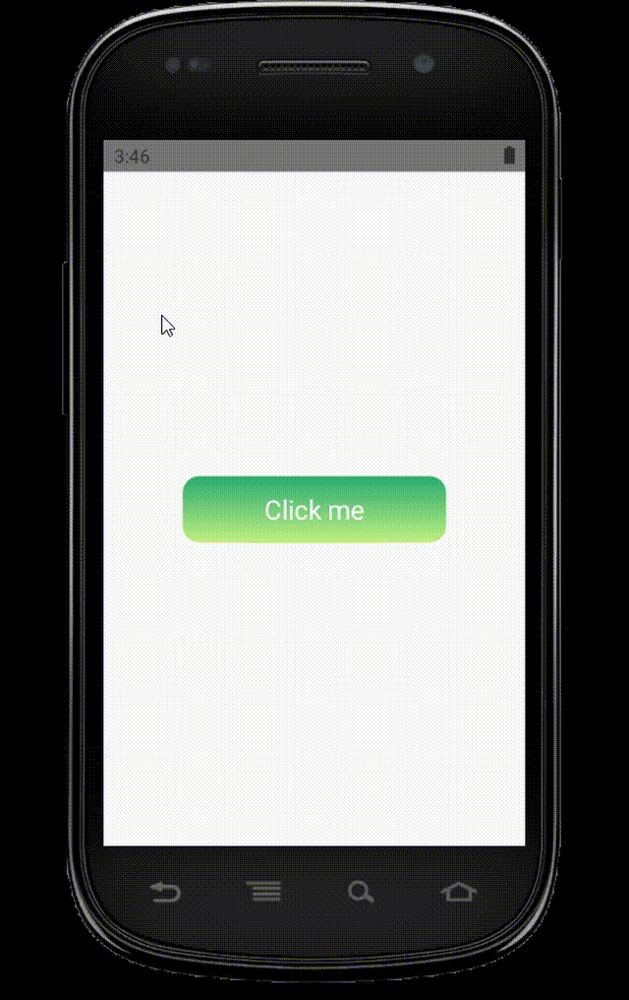
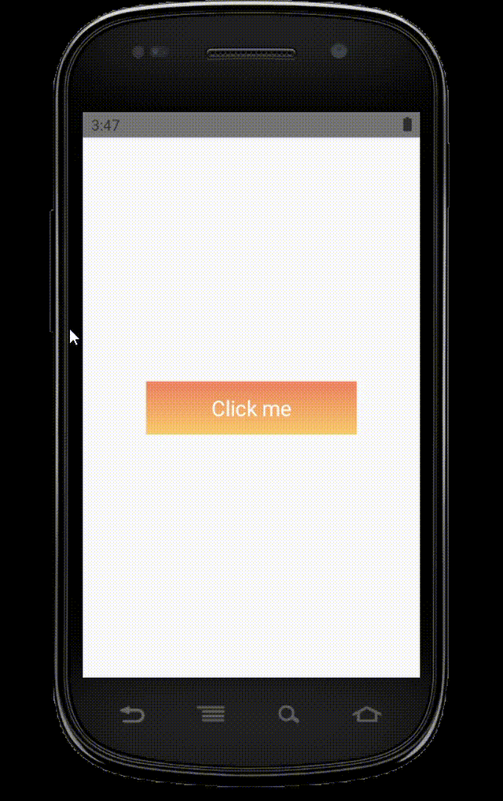
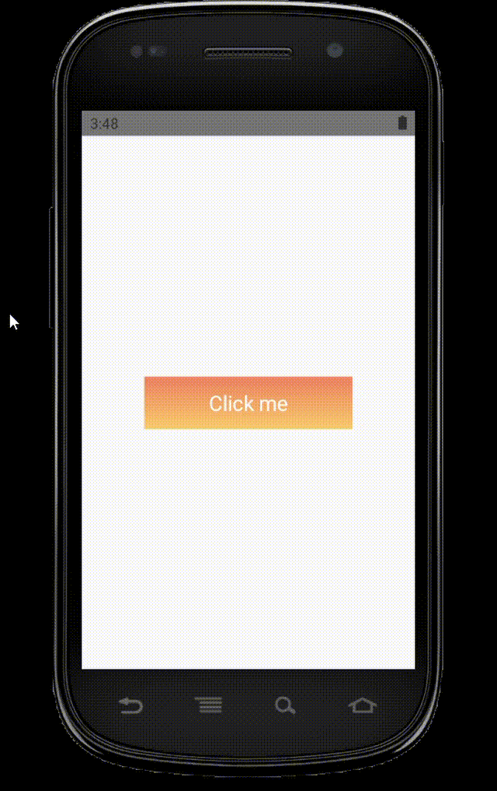

# react-native-jelly-button

a react native button with jelly effect

  
## Installation

```sh
npm install react-native-jelly-button
```

## Usage

```js
import JellyButton from "react-native-jelly-button";

// ...
<JellyButton
        height={50}
        width={200}
        gradientStart={'#219D72'}
        gradientEnd={'#C3E87F'}
        borderRadius={50}
      >
        <View>
          <Text style={{ color: 'white', fontSize: 20 }}>{'Click me'}</Text>
        </View>
</JellyButton>
```

## Props
```ts
      width: number; // button width
      height: number; // button height
      borderRadius?: number; //defualt 0 not all values are supported
      animateGradient?: boolean; //defualt false
      gradientStart: string; // color
      gradientEnd: string; // color
      gradientStartOpacity?: number; //defualt 1, a value from 0 to 1
      gradientEndOpacity?: number; //defualt 1, a value from 0 to 1
      onPress?: () => void;
```
      
## Contributing

https://github.com/youssefali424/react-native-jelly-button

## License

MIT
